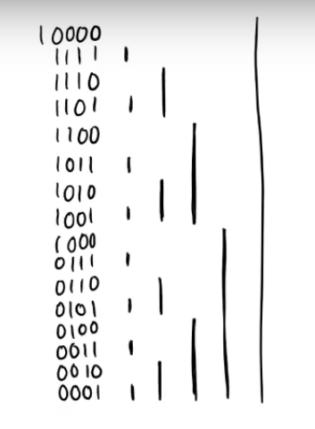
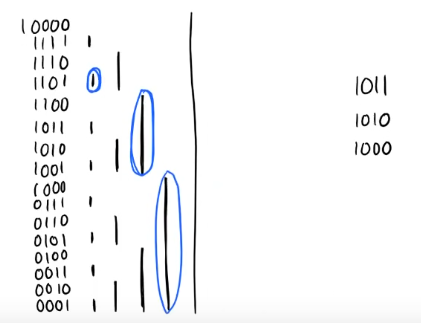
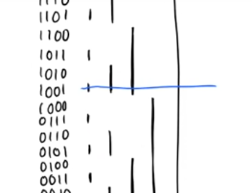

# Why are Fenwick Trees / Binary Indexed Trees (BITs) needed?
Normally Prefix sums have $O(1)$ query time, and $O(n)$ recompute time in case of update. BIT is used to improve this. Although Segment Trees can perform same operations but a BIT is easier to code and faster.

- An element $i$ in BIT is responsible for number of elements equal to $(1$ `<<`  $lowestSetBit(i))$

<p align="center">
  
</p>

# How to compute Prefix sums?

> 1. Take what you are responsible for
> 2. Staircase down

<p align="center">
  
</p>

To staircase down, you just remove the lowest set bit.
Example: 
```
1-based: 1011 -> 1010 -> 1000
          [1] -> [4] -> [8]
```
Adding all these values gives the prefix sum for $1011_{2}$ or $11_{10}$

> 3. The runtime depends on number of bits, thus in worst case time complexity to query is $O(log(n))$ as there are atmost $log(n)$ bits in $n$.

# How to Update?


<p align="center">
  
</p>

> 1. To update an index, you must update all cells that own it

For a given index, to find out which cells to update, just draw straight line in the representation

- The elements of BIT that need to be updated are all bits that are not set in given index
Example:
```
1-based:
01001 -> 01000
 (9)
- --
[01010, 01100, 10000] 
 - --   - --   - --
 (10)    (12)   (16)

0-based:
9 is at 1000
1000 -> 1001 -> 1011 -> 1111
 (9)    (10)    (12)    (16)
```

> 2. Move by adding lowest set bit to current index if 1 based indexing. If 0 based indexing, move by setting lowest not set bit, by $x = x$ `|` $x + 1$ 
> 3. Also runs in $O(log(n))$ complexity.

Example:
$01001$ `->` $01010$ `->`$01100$ `->` $10000$

# How to find lowest set bit?

Use bitwise `AND` operation and do $i$ `&` $(-i)$
