# Graphs
A Graph is a non-linear data structure consisting of nodes and edges. The nodes are sometimes also referred to as vertices and the edges are lines or arcs that connect any two nodes in the graph. More formally a Graph can be defined as,
> A Graph consists of a finite set of vertices(or nodes) and set of Edges which connect a pair of nodes.

Graphs are used to solve many real-life problems. Graphs are used to represent networks. The networks may include paths in a city or telephone network or circuit network.

> A path in a graph is a finite or infinite sequence of edges which joins a sequence of vertices which, by most definitions, are all distinct (and since the vertices are distinct, so are the edges). A directed path (sometimes called `dipath[1]`) in a directed graph is a finite or infinite sequence of edges which joins a sequence of distinct vertices, but with the added restriction that the edges be all directed in the same direction. 

Graphs are also used in social networks like linkedIn, Facebook. For example, in Facebook, each person is represented with a vertex(or node). Each node is a structure and contains information like person id, name, gender, locale etc.

### Example 
If the following graph represents a network of friends, then 
- Node 2 and 1 are friends
- Node 2 and 4 aren't (they are mutual friends of 1 and 3)

<!--  -->
<p align="center">
  
</p>


In the above undirected Graph, the set of vertices `V = {0,1,2,3,4}` and the set of edges `E = {(1, 0), (0, 4), (1, 4), (1, 3), (3, 4), (1, 2), (3, 2)}`.

<br><br>

## Representations

A graph is a data structure that consists of the following two components: 
1. A finite set of vertices also called as nodes. 
2. A finite set of ordered pair of the form (u, v) called as edge. The pair is ordered because (u, v) is not the same as (v, u) in case of a directed graph(di-graph). The pair of the form (u, v) indicates that there is an edge from vertex u to vertex v. The edges may contain weight/value/cost.


The following two are the most commonly used representations of a graph. 
1. Adjacency Matrix 
2. Adjacency List 
There are other representations also like, Incidence Matrix and Incidence List. The choice of graph representation is situation-specific. It totally depends on the type of operations to be performed and ease of use. 

### [Adjacency Matrix](./Adjacency_Matrix.cpp)
- Adjacency Matrix is a 2D array of size V x V where V is the number of vertices in a graph. 

- Let the 2D array be `adj[][]`, a slot `adj[i][j] = 1` indicates that there is an edge from vertex i to vertex j. 

- Adjacency matrix for undirected graph is always `symmetric`. 

- Adjacency Matrix is also used to represent weighted graphs. If `adj[i][j] = w`, then there is an edge from vertex i to vertex j with weight w. 

The adjacency matrix for the above example graph is: 

<!--  -->
<p align="center">
  
</p>

#### Pros
- Representation is easier to implement and follow. 
- Removing an edge takes `O(1)` time. 
- Queries like whether there is an edge from vertex ‘u’ to vertex ‘v’ are efficient and can be done `O(1)`.

#### Cons
- Consumes more space `O(N^2)`. Even if the graph is sparse(contains less number of edges), it consumes the same space. 
- Adding a vertex is `O(N^2)` time. 

### [Adjacency List](./Adjacency_List.cpp): 
- An array of lists is used. The size of the array is equal to the number of vertices. 

- Let the array be an `array[]`. An entry `array[i]` represents the list of vertices adjacent to the ith vertex. This representation can also be used to represent a weighted graph. 

The weights of edges can be represented as lists of pairs. Following is the adjacency list representation of the above graph:

<!--  -->
<p align="center">
  
</p>

#### Pros
- Saves space `O(|V|+|E|)` OR `O(2M)` where M is number of edges.
- In the worst case, there can be `C(V, 2)` number of edges in a graph thus consuming `O(N^2)` space. 
- Adding a vertex is easier.

#### Cons 
- Queries like whether there is an edge from vertex u to vertex v are not efficient and can be done `O(N)`.

<br><br>

# Important Terms:

-   Two nodes are  if there exists a path between them. Example: `1->2->3->4`, 1 and 4 are connected
  Thus connectivity is defined based on path

-   : We come back to the same node without repeating. Example: `1->2->3->4->1`

-   : Number of edges between 2 connected nodes (on the path). Example: `1->2->3->4`, distance is 3

## Types of graph:
  -
    -   : Edges are non directional. Example: Brother 1 <-> Brother 2 (Bidirectional relationship) [1 -- 2]
    
    -   : Edges are directional. Example: Father -> Son (Unidirectional) 1 --> 2

<br/>

  -  
    -   : Edges have weights. Example: Flight route with cost of edges    

    -    : Normal Edges

<br/>


  - 
    - : If the graph has atleast one cycle
    
    - : otherwise

<br/>

  -
    - : Path from any node to any other node
    -  : Otherwise, A disconnected graph will have multiple connected components.

<br/>

## Trees and Forests:
  -   Both are Acyclic. No cycle is allowed.
  -       - Graph is connected.
      <br>  - Graph is disconnected.
  -   Thus forest has different components. Forests are collection of trees, Thus its name.

### Connected components: 
1. In a connected component, all nodes are connected to each other.

2. A connected component needs to be maximal. (Should not be a part of something bigger)

<br><br>

# [Connectivity Check](./dfs.cpp)

> Tell if a given graph is connected or not.

If we start along some vertex, and follow the edges, we must be able to reach all other vertices.

### How to store a graph in a program?

> We need to know which vertex is connected to which others

1. Adjacency Matrix, `adj[][]` (Discussed above)
2. Adjacency List (Discussed above) `[Uses less memory]`

<p align="center">
  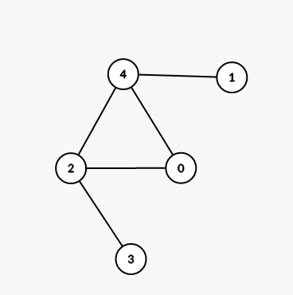
</p>

### [DFS (Depth First Search)](https://cp-algorithms.com/graph/depth-first-search.html)

We can mark the uncoloured nodes with some color and count how many we marked in total, if it is equal to number of nodes then the graph is connected
> Just like throwing popcorn in maze to find out the exit<br><br> A grid is just like a graph, with positions we can move to representing the nodes.

> ***[DFS can also be used to find the actual path from one node to another and simultaneously checking if it exists](./getPath_dfs.cpp)***

<p align="center">
  
</p>

#### Algorithm: 
```py
count = 0

dfs(node):
    color[node] = blue; count++
     # Takes list for a vertex from adj list
    for X in adj[node]:  
        if color[X] = blue:
            continue
        # Recursively go through all connected nodes
        dfs(X)
```

#### Code (C++):

```cpp
const int N = 1'00'000;  // maximum number of nodes
vector<int> adj[N];      //adjacency list
bool visited[N];
int cnt;

void dfs(int node) {
    // mark it blue
    visited[node] = true;
    cnt++;
    for (int x : adj[node]) {
        if (visited[x]) continue;
        dfs(x);
    }
}

int main() {
    int n;  // nodes
    cin >> n;
    int m;  // edges
    cin >> m;
    for (int i = 0; i < m; ++i) {
        int x, y;
        cin >> x >> y;  // represents edge between x and y
        adj[x].push_back(y);
        adj[y].push_back(x);
        // As undirected so both edges
    }
    dfs(1);  // dfs from any node
    if (n == cnt) {
        // connected graph
    } else {
        // not connected
    }
    return 0;
}
```

> What is the time complexity of dfs?

`O(m + n)` if `m` is number of edges and `n` is number of nodes

> Why?

How many times do we visit a certain node? 
`1` time as we never visit an already marked node
Then it should be `O(n)` right?

> Where does the O(n + `m`) come from?
<br> How many times do we visit a single Edge?

`2` times, as When at node A, `A->B`
and similarly when at node B, `B->A`. Thus n + 2*m reduces to `O(n+m)` complexity.

<br><br>

# [Connected Components](https://cp-algorithms.com/graph/search-for-connected-components.html)

> Count number of connected components in a given graph.

<p align="center">
  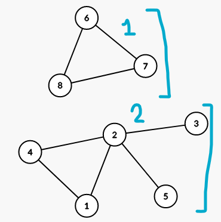
</p>


`Example`: Counting number of rooms in a given area.

<p align="center">
  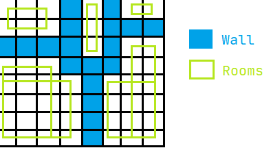
</p>

### Algorithm:
```py
components = 0

loop node from 1 to n:
    if node is blue:
        continue
    dfs(node)          #This function will look same
    components += 1
```

> Find number of rooms in following map of building <br>[CSES - 1192](https://cses.fi/problemset/task/1192/)
<p align="center">
  
</p>


### Code (C++):
```cpp
int dx[] = {0, 0, 1, -1};
int dy[] = {1, -1, 0, 0};

int n, m;
bool visited[1010][1010];
char grid[1010][1010];

bool isValid(int x, int y) {
    if (y < 0) return false;
    if (x < 0) return false;
    if (y >= m) return false;
    if (x >= n) return false;
    if (grid[x][y] == '#') return false;
    return true;
}

void dfs(int x, int y) {
    visited[x][y] = true;
    for (int i = 0; i < 4; i++) {
        int X = x + dx[i];
        int Y = y + dy[i];
        if (isValid(X, Y)) {
            if (!visited[X][Y]) {
                dfs(X, Y);
            }
        }
    }
}

void CountingRooms() {
    cin >> n >> m;
    for (int i = 0; i < n; i++) {
        for (int j = 0; j < m; j++) {
            cin >> grid[i][j];
            visited[i][j] = 0;
        }
    }
    int components = 0;
    for (int i = 0; i < n; i++) {
        for (int j = 0; j < m; j++) {
            if (grid[i][j] == '.' && !visited[i][j]) {
                dfs(i, j);
                components++;
            }
        }
    }
    cout << components;
}
```

## Methods of Graph Transversal

There are two algorithms for graph transversal:
1. DFS (Depth First Search) `[Already Discussed]`
2. [BFS (Breadth First Search)](https://cp-algorithms.com/graph/breadth-first-search.html)


`Transversal` is in the following manner:
<p align="center">
  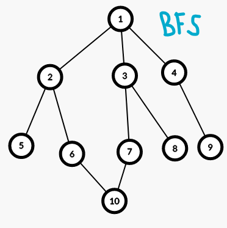
  &nbsp;
  &nbsp;
  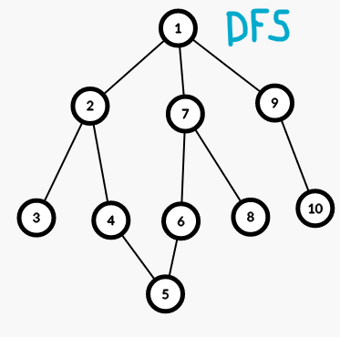
</p>

### Uses of BFS:

1. It can be used to find shortest distance between 2 nodes.

2. We can fix a node and find ***shortest distance*** from it to all other nodes.

3. We can also use BFS to find the predecessors/parent of a given node and then use that to ***[backtrack to the shortest path from one node to another](./1193.cpp)***<br>

<p align="center">
    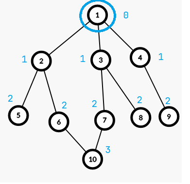
</p>

`Example`: Shortest path between two houses in a city

### Algorithm:
```py
#A queue is used to store the order in which we visit vertices
queue 
push initial vertex
distance[initial] = 0
while queue not empty:
    take front of queue
    add all unvisited children to queue
    mark distance
```

### Code (C++):
```cpp
const int N = 1'00'000;  // maximum number of nodes
vector<int> adj[N];      //adjacency list
int dis[N];
bool pushed_in_queue[N];  // visited

int main() {
    int n;  // nodes
    cin >> n;
    int m;  // edges
    cin >> m;

    for (int i = 0; i < m; ++i) {
        int x, y;
        cin >> x >> y;  // represents edge between x and y
        // Undirected
        adj[x].push_back(y);
        adj[y].push_back(x);
    }

    // lets say we have to run bfs from 1
    queue<int> q;
    q.push(1);  // fixed vertex
    dis[1] = 0;
    pushed_in_queue[1] = true;

    while (!q.empty()) {
        int node = q.front();  // currently visiting this node
        q.pop();               // dont want to visit this again

        // Go through all children
        for (int x : adj[node]) {
            if (pushed_in_queue[x] == true) continue;
            q.push(x);  //visit x later
            dis[x] = dis[node] + 1;
            pushed_in_queue[node] = true;  // to make sure we dont visit twice
        }
    }

    cout << dis[10];  // must be 3

    return 0;
}
```

> What is time complexity of bfs?

`O(n + m)` because every vertex is pushed and popped from queue only once, and every edge is visited twice `[Similar to DFS]`

<br><br>

# Multisource BFS:

> In an unweighted graph, this is the fastest way to visit all nodes starting from the "special" nodes. Thus can be used to find [number of unvisited nodes](./unvisited_in_grid.cpp) / length of shortest path / the shortest path itself. 

We are given a matrix denoting some oranges, Green means rotten orange and orange means ripe.
Every ripe orange adjacent to a rotten orange will rot in a minute.
<p align="center">
    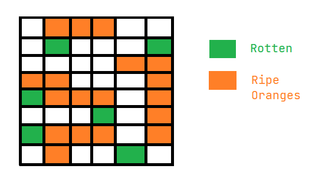
</p>

> Q1. Will All oranges Rot?

Yes! All oranges will rot here, But how to check that using code?

All oranges can be connected as vertices of graph, and we have to check that each connected component contains atleast one rotten orange, Thus only needs basic DFS.

> Q2. Assume that all oranges will rot. Find the minimum time taken for all oranges to rot.

#### Method 1: `O(NM*NM)`

We run a BFS from each ripe orange to nearest rotten orange in O(NM) time and as there are NM vertices at max, the complexity is `O(NM*NM)`.

#### Method 2: `O(NM)` -> Multisource BFS

<p align="center">
    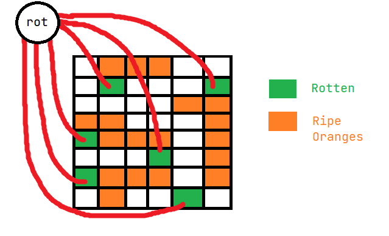
</p>

We consider an imaginary node "rot" and connect all rotten oranges to it. Now BFS from "rot" to all other nodes give minimum distance from it, and `dist[i] - 1` gives distance from nearest rotten orange.

The maximum distance gives the time taken.

Thus BFS only once, so `O(NM)`

> When this is done, instead of pushing extra node in graph, we can instead push the rotten nodes in queue intially. [Because this will happen anyway after "rot" is popped.]

### Code (C++):
```cpp
int n, m;
int a[1000][1000];
bool vis[1000][1000];

bool valid(int x, int y) {
    if (x < 0 || y < 0 || x >= n || y >= m) return false;
    if (vis[x][y] || a[x][y] == 0) return false;  // if already visited or empty
    return true;
}

// graph moves - 4 directions
int dx[] = {1, 0, -1, 0};
int dy[] = {0, 1, 0, -1};

int main() {
    cin >> n >> m;
    for (int i = 0; i < n; i++) {
        for (int j = 0; j < m; j++) {
            cin >> a[i][j];
        }
    }

    // {x, y, distance}
    queue<array<int, 3>> q;
    for (int i = 0; i < n; i++) {
        for (int j = 0; j < m; j++) {
            if (a[i][j] == 2) {
                q.push({i, j, 0});  //distance 0 for rotten orange
                vis[i][j] = true;
            }
        }
    }

    int ans = 0;  // max distance of any code
    while (!q.empty()) {
        int x = q.front()[0];
        int y = q.front()[1];
        int dis = q.front()[2];

        ans = max(ans, dis);

        q.pop();
        for (int i = 0; i < 4; ++i) {  // 4 directions
            int X = x + dx[i];
            int Y = y + dy[i];

            int newDis = dis + 1;
            if (valid(X, Y)) {
                vis[X][Y] = true;
                q.push({X, Y, newDis});
            }
        }
    }
    cout << ans << '\n';
    return 0;
}
```

<br><br>

# [Dijkstra's Algorithm](https://cp-algorithms.com/graph/dijkstra_sparse.html):

> There are different cities and flights between them, flying cost for each route is given, We have to minimize the total cost of going from city A to city B.

<p align="center">
    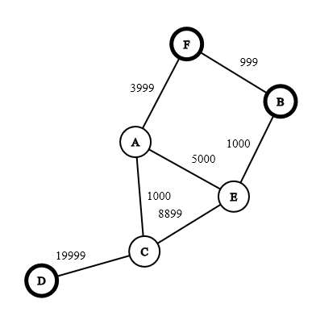
</p>

> `BFS` would have worked here, if the graph was unweighted or cost of each flight is same.

Thus we can convert all to equal weights, by adding extra nodes in between. `[Hack]`


<p align="center">
    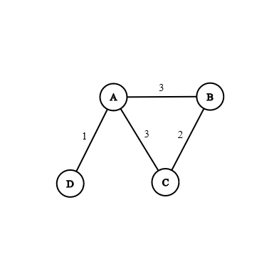
    &nbsp;
    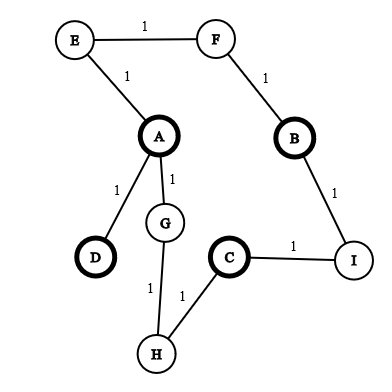
</p>

Now, as BFS works, we can just use it.<br><br>But the `problem` is that there might be a long edge. Example: If the weight is , we have to add many edges which is `NOT` feasible.

> It can be observed that nodes with less distance are visited first. This observation is the base of `Dijkstra's Algorithm`

### Algorithm: 

This is just like BFS but instead of a queue, we use a `set` or a `priority queue`.
We push `{distance, node}` in the set.

> We initiallise all distance to infinite. Then we push the source in set. Then we pop it and do BFS stuff. Now we iterate all children (Adj. vertices) to find their new distance now if newDis is smaller than old distance we modify it.

### Code (C++):

```cpp
const int INF = 1e9;

// Node and weight
vector<pair<int, int>> v[100005];
int d[100005];  // distance

int main() {
    int n, m;  // vertices, edges
    cin >> n >> m;
    for (int i = 0; i < m; i++) {
        int x, y, w;
        cin >> x >> y >> w;
        v[x].push_back({y, w});
        v[y].push_back({x, w});
    }
    // initially all nodes at INF distance
    for (int i = 1; i <= n; ++i) d[i] = INF;

    // source is 1.
    d[1] = 0;
    // distance 1st so it is sorted
    set<pair<int, int>> s;  //{distance, node}
    s.insert({0, 1});
    while (!s.empty()) {
        int dis = s.begin()->first;
        int vertex = s.begin()->second;
        s.erase(s.begin());

        for (pair<int, int> x : v[vertex]) {
            int newDis = dis + x.second;
            int newVer = x.first;
            if (newDis < d[newVer]) {
                //! can erase non existent element from set freely
                s.erase({d[newVer], newVer}); // erase old distance
                d[newVer] = newDis;  // update
                s.insert({d[newVer], newVer});
            }
        }
    }

    for (int i = 1; i <= n; ++i) {
        cout << d[i] << ' ';
    }
    return 0;
}
```

The time complexity of dijkstra's algorithm is `O(nlogm + mlogn)`, but usually `m > n`, thus `O(mlogn)` [`FASTER` than Multisource bfs]
<br><br>For each edge we are pushing something in set, thus `nlogm`(Because of set operations) and for each vertex we are poppong something out which gives `mlogn`.

- Each node visited once.
- Each edge visited twice.

> How to store predecessors using Dijkstra? [Here](https://cp-algorithms.com/graph/dijkstra.html)

#### Dry run :
<p align="center">
    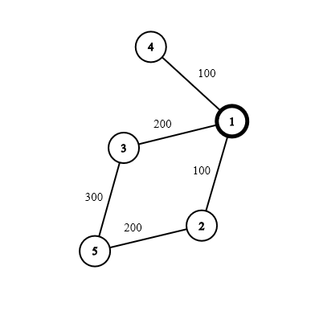
</p>


- After updating children, s = {(100, 4)}
- After updating children, s = {(100, 4), (200, 3)}
- After updating children, s = {(100, 2), (100, 4), (200, 3)}
- Before erasing parent, s = {(100, 2), (100, 4), (200, 3)}
- After updating children, s = {(100, 4), (200, 3), (300, 5)}
- Before erasing parent, s = {(100, 4), (200, 3), (300, 5)}
- Before erasing parent, s = {(200, 3), (300, 5)}
- Before erasing parent, s = {(300, 5)}<br>

Finally we have, `dis[] = {0, 100, 200, 100, 300}`

# Multisource Dijkstra:

> We are given a map of a city with traffc. The traffic is represented by time taken to travel throught that road. Hospitals are marked as blue and patients are marked as yellow. find nearest hospital for each patient.

<p align="center">
    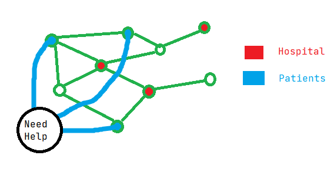
</p>

This can be done by similarly creating a `"Need healthcare"` Node and connecting all patients to it, with `weight 0`. And now Dijkstra can be used with this as a source for all hospitals. [All patients can be inserted in the set already]


<br><br>
<br><br>
<br><br>
# Relevant Questions:

- DFS - [CF - 500A](https://codeforces.com/contest/500/problem/A)
- DFS - [CF - 884C](https://codeforces.com/contest/884/problem/C)
- DFS - [CF - 893C](https://codeforces.com/contest/893/problem/C)
- DFS - [CF - 1020B](https://codeforces.com/contest/1020/problem/B)
- DFS on Grid - [CSES - 1192](https://cses.fi/problemset/task/1192)
- DFS on Grid - [CF - 1033A](https://codeforces.com/contest/1033/problem/A)
- DFS and Find Path - [CF - 1057A](https://codeforces.com/contest/1057/problem/A)
- DFS and Graph Coloring - [CF - 902B](https://codeforces.com/contest/902/problem/B)
- DFS and Graph Coloring - [CF - 1167C](https://codeforces.com/contest/1167/problem/C)
- DFS and Missing Edges [CSES - 1666](https://cses.fi/problemset/task/1666)
- BFS on Grid - [CF - 57A](https://codeforces.com/contest/57/problem/A)
- BFS and Find Path (Grid) [CSES - 1193](https://cses.fi/problemset/task/1193)
- BFS and Find Path [CSES - 1667](https://cses.fi/problemset/task/1667)
- BFS on String - [CF - 1183E](https://codeforces.com/contest/1183/problem/E)
- Multisource BFS twice (Invert Graph) - [CF - 1272E](https://codeforces.com/contest/1272/problem/E)
- Multisource BFS - [CF - 1593E](https://codeforces.com/contest/1593/problem/E)
- Dijkstra - [CSES - 1671](https://cses.fi/problemset/task/1671)