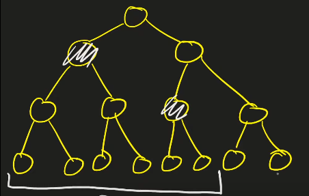
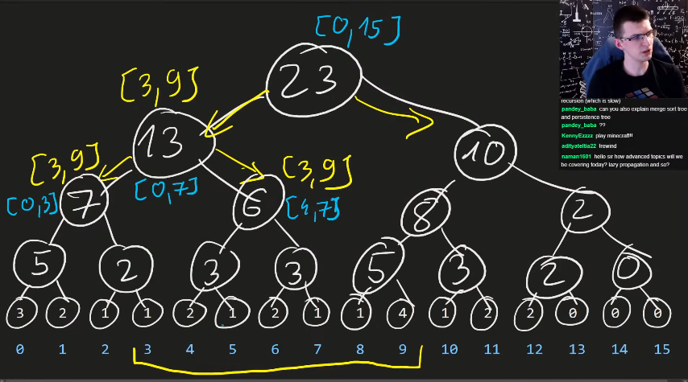
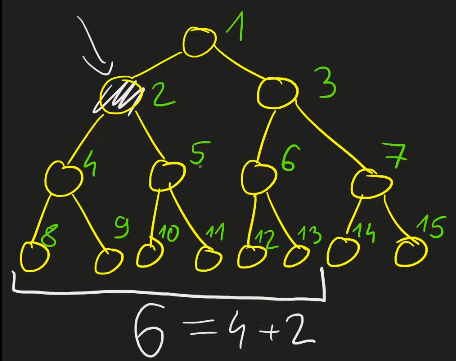

## How does a segment tree work?

The array is first of all converted to a full binary tree.

For example, if we want to find sum of first 6 elements, We can use the marked nodes and calculate it.

<p align="center">
  
</p>

## How much time is taken to build a segment tree?

If we have 16 elements in an array (or 16 leaves in our binary tree), the upper level would have 8 nodes.
Thus total number of nodes will be 
`16 + 8 + 4 + 2 + 1 = 32 - 1`. Thus we have ~ `2 * N` total nodes and so the time taken to build a segment tree is `O(N)`.

## How to answer query about a range?

If we have a sum query from `[L, R]`, Start from root then go to each node and ask the sum of `[L, R]` inside that range.

`NOTE:` If some subpart of `[L, R]` is completely present in the range covered by a node, we dont go lower and directly include that value.

<p align="center">
  
</p>

Source: [Errichto 2](https://www.youtube.com/watch?v=2FShdqn-Oz8)

```cpp
int f(int node, int q_lo, int q_hi){
    if(this node is completely within interval [q_lo, q_hi])
        return tree[node]; // tree[i] will contain sum contained in node i
    if(this node is disjoint with interval [q_lo, q_hi])
        return 0;
    return f(left, q_lo, q_hi) + 
           f(right, q_lo, q_hi);
}
```

A better version with more details is:
```cpp
int f(int node, int node_lo, int node_hi, int q_lo, int q_hi){
    if(q_lo <= node_lo && node_hi <= q_hi)
        return tree[node];
    if(node_hi < q_lo || q_hi < node_lo)
        return 0; // disjoint
    int last_in_left = (node_lo + node_hi) / 2; // rounded down
    return f(left, node_lo, last_in_left, q_lo, q_hi) + 
           f(right, last_in_left + 1, node_hi, q_lo, q_hi);
}

f(ROOT, 0, n - 1, q_lo, q_hi); // n is power of 2 here
```

But what is `left` and `right` here?

<p align="center">
  
</p>

For any `x`, its children are `2 * x` and `2 * x + 1`, and root is `1`.

Thus now our code becomes:
```cpp
int f(int node, int node_lo, int node_hi, int q_lo, int q_hi){
    if(q_lo <= node_lo && node_hi <= q_hi)
        return tree[node];
    if(node_hi < q_lo || q_hi < node_lo)
        return 0; // disjoint
    int last_in_left = (node_lo + node_hi) / 2; // rounded down
    return f(2 * node, node_lo, last_in_left, q_lo, q_hi) + 
           f(2 * node + 1, last_in_left + 1, node_hi, q_lo, q_hi);
}

f(1, 0, n - 1, q_lo, q_hi); // n is power of 2 here
```

## How to update the tree?
We know that an index `i` has index `n + i` in `tree[]`. 
So, if we update `node`, we can recalculate the value of all its `parents`.
For any `node`, its `parent` is `node / 2`, and then we can do the following.

```cpp
// set a[i] = v
void update(int i, int v) {
    tree[n + i] = v;
    for(int j = (n + i) / 2; j >= 1; j /= 2){
        tree[j] = tree[2 * j] + tree[2 * j + 1];
    }
}
```

For the recursive function, do something similar to queries. The complete overlap condition is encountered only at the actual position and the disjoint one is used to return when a node that is not parent is encountered.

After updating a node, we can recalculate the corresponding `tree[]` values in the post call area.

```cpp
void update_R(int node, int node_lo, int node_hi, int q_lo, int q_hi, int value) {
    if (q_lo <= node_lo && node_hi <= q_hi) {
        // happens only once when leaf [id, id]
        tree[node] = value;
        return;
    }
    // in disjoint just return
    if (node_hi < q_lo || q_hi < node_lo) return;
    int last_in_left = (node_lo + node_hi) / 2;
    update_R(2 * node, node_lo, last_in_left, q_lo, q_hi, value);
    update_R(2 * node + 1, last_in_left + 1, node_hi, q_lo, q_hi, value);

    // after updating now set, Post Call Area
    tree[node] = tree[2 * node] + tree[2 * node + 1];
};
```

- As both query and update functions were almost same, we can make a super function that does both things based on `value` parameter.