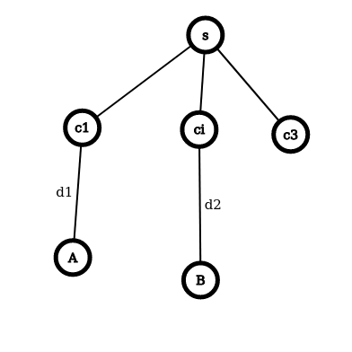
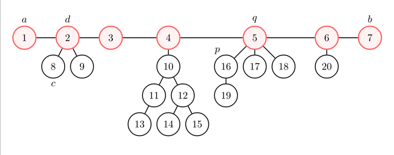
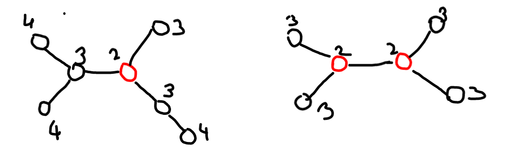
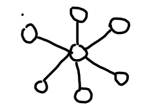
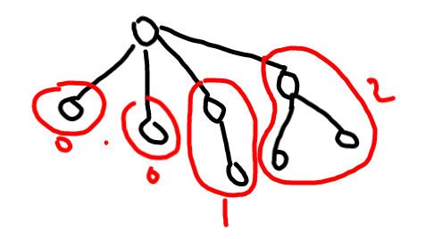
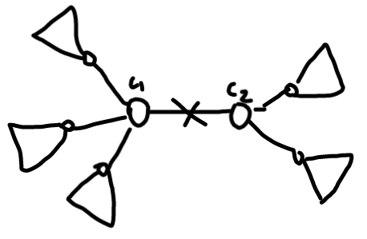
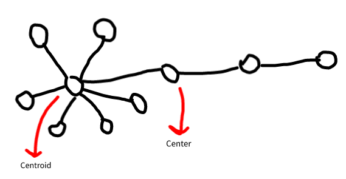

# Trees
These are connected undirected graphs with:    
1. no cycles
2. or, only unique paths between two vertices
3. or, n vertices, n - 1 edges
4. or, all edges are bridges

All these can be proved using one another, i.e. all these are equivalent.

---

# [Diameter](https://cses.fi/problemset/task/1131):

## Graph: 
longest of all shortest paths in a graph.

### **How to find?**
- Use floyd warshall to find length of shortest paths between all nodes. Find maximum of them.
- _Time complexity_ is $O(log(n))$

## Tree:
As all paths are unique, the answer here is just the longest path.

### **How to find?**

1. BFS from all nodes, and find largest. 
    - Time complexity is $O(n^2)$ as there are $n - 1$ edges and Time Complexity of a BFS is $O(V + E)$
2. Find $h(v)$, height of node $v$ for all nodes.
    - Use heights of all nodes to find the length of diameter, Assuming diameter goes through current node.
    - Find maximum of all these answers
3. Greedy Approach
    - Pick any node, s
    - Run BFS from s
    - Find furthest node from s, t = furthest(s)
    - Run BFS from t
    - Find furthest node from t, r = furthest(t)
    - Diameter is path from r to t.

### Q. Why does the greedy method work? ***[PROOF]***
Case 1: Picked node s is on diameter of tree
- First BFS gives one endpoint of diameter
- Second BFS gives other endpoint of diameter

Case 2: Picked node is not on diameter
- Then to get endpoint of diameter, diameter must be in deepest subtree if tree is rooted at s.
- Assume deepest subtree $c_1$ does not contain the diameter.

  

$d(c_1) = d_1$.

Let diameter in a subtree $c_i$, with $d(c_i, B) = d_2$.
We know that $d_2 \leq d_1$. 

Thus, in subtree $c_i$, the diameter can be $2d_2$, whereas in $s$, $d(s) = d_1 + d_2 + 2$. Thus $d(s) > d(c_i)$, which poses a contradiction. 

***QED***

## Tree = edges of diameter + forest

  

In other words, the height of each component with root in the left half of the diameter (i.e., $dist(a, d) < dist(d,b)$) is at most the distance of the root of the component from the left end of the diameter.

You can prove the same statement for the right half of the diameter (i.e., $dist(a, d) ≥ dist(d, b)$), using that $b$ is the farthest node from $a$.

## [Farthest node for each node - Remoteness](https://cses.fi/problemset/task/1132/):
For each node $i$, let's find a node $j$ such that $dist(i, j)$ is maximum.

- Claim: $j = a$ or $j = b$ always works.

---

# Center of a tree

- If remoteness of a node is its distance from the furthest node.
- Center is the node which has minimum remoteness.

  

### Theorem:
All diameters in T, must go through center c.

### Proof:
Assume diameter does not go through c.

1. Root the tree at c.
2. Any subtree of c, has $d_1$ or $d_1 - 1 (d_2)$ edges. Thus $d(c) > d(subtree)$. $d(subtree) = 2d_1$ and $d(c) = 2 + d_1 + d_2$.
3. Thus c must be on diameter

***QED***

### Theorem:
There are atmost $2$ centres in a tree.

---

# Count Number of diameters in a Tree:

  

For a graph of this kind, there are $C(n - 1, 2)$ diameters which is of the order of $n^2$.

Case 1: Tree has 1 center.
- $s_i = $ Number of nodes at depth $diameter / 2$ in subtree $i$ if tree is rooted at center.

  

So we have to select 2 nodes 1 from a given subtree and other from any other subtree.

Number of diameters = $\sum_{i=1}^{n}(s_i~~\cdot~~\sum_{j=1}^{i-1} s_j)$

The inner summation can be calculated using running sum, and thus this can be made fast.

Case 2: Tree has 2 centres.

  

- Number of nodes at maximum depth in $c_1$ * $c_2$.

---

# Centroid
It is the node that when removed, minimizes the size of largest component formed.

  

Let $s(v)$ be size of subtree for each node $v$.
- $s(v) = 1$, if v is leaf
- $s(v) = 1 + \sum_{x=children} s(x)$, otherwise.

Thus centroid is the node with minimum value of maximum size of all subtrees and parent tree left, i.e.

$ans = min(ans, max(n - \sum s(x) - 1, s(i)~for~each~subtree))$

Centroid is the node which minimizes the value of $ans$.

## Properties:
1. For a tree, there are atmost 2 centroids. And, if there are two, then they must be adjacent.
2. A centroid on removal, divides the tree into components with size $\leq \lfloor n / 2 \rfloor$.

> This is why centroid decomposition can be used. Just like binary search divides array in half, centroid divides tree into subtrees with less than half size. 

> Thus Divide N Conquer on trees uses Centroid decomposition. Other Similar DnC techniques are merge sort and binary search.

> Tree can be decomposed into centroid tree by finding centroids of subtree recursively, and this can be used to solve path queries, using precomputation and LCA.

---

# Divide and Conquer on trees:

As centroid decomposition divides trees into components of atmost $n / 2$, then in worst case the runtime is $O(nlog(n))$, but actually some time is saved as we dont always divide it into 2 subtrees.

- [Question](https://codeforces.com/contest/342/problem/E)

- [Tutorial 1](https://medium.com/carpanese/an-illustrated-introduction-to-centroid-decomposition-8c1989d53308)
- [Tutorial 2](https://codeforces.com/blog/entry/81661)
- [Tutorial 3 - Best](https://www.youtube.com/watch?v=3pk02p1-weU)

### Pattern:
1. Solve the problem for all paths going through some node.
2. Remove node.
3. Solve remaining subproblems.

---

# Yin Yang paths (Simpler):
Given a tree $T$, with $N$ nodes, with some black edges and other white edges. Count number of balanced paths.

$N(Yin) = N(Yang)$

Solution:
1. Count paths through centroid.
2. Remove centroid.
3. Solve for subproblems.

> As there can be atmost $(n/2)^2$ balanced paths, imagine star shaped graph with $n/2$ Black edges and other white edges, we need to find count of paths through the centroid quickly.